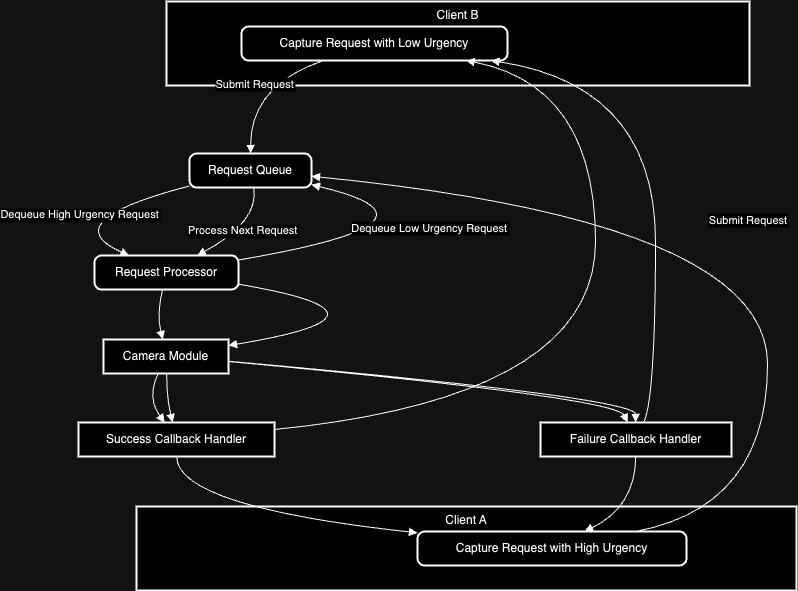

# High-Level Design (HLD) Document for Camera-System

## 1. Overview
The camera-system is designed to handle concurrent capture requests from multiple clients with varying urgency levels. The system prioritizes these requests and interacts with an abstracted camera-module to capture images asynchronously. The system also manages callbacks to handle success or failure of the capture operation.

## 2. System Components and Responsibilities

### 2.1 Client
- **Description**: Represents any code logic that submits a capture request to the camera-system.
- **Responsibilities**:
  - Submits capture requests with urgency levels.
  - Registers success and failure callbacks.
  - Waits for the callbacks to receive the captured image or an error message.

### 2.2 Camera-System
- **Description**: Core system that manages the interaction between multiple clients and the camera-module.
- **Responsibilities**:
  - Accepts and prioritizes multiple capture requests.
  - Manages the request queue based on urgency.
  - Communicates with the camera-module to capture images.
  - Handles the invocation of success or failure callbacks.

### 2.3 Camera-Module (Abstracted)
- **Description**: Represents the actual camera hardware or software responsible for capturing images.
- **Responsibilities**:
  - Asynchronously captures images when a capture request is received.
  - Invokes the success or failure callback based on the capture outcome.

### 2.4 Request Queue
- **Description**: A priority queue within the camera-system that holds capture requests.
- **Responsibilities**:
  - Stores capture requests sorted by urgency.
  - Ensures that higher priority requests are processed before lower priority ones.

### 2.5 Request Processor
- **Description**: Component responsible for processing capture requests by interacting with the camera-module.
- **Responsibilities**:
  - Dequeues the highest priority request from the queue.
  - Forwards the request to the camera-module.
  - Ensures that the system can handle multiple requests concurrently.

### 2.6 Callback Handler
- **Description**: Manages the invocation of callbacks based on the outcome of the capture operation.
- **Responsibilities**:
  - Invokes the success callback with the captured image when the capture is successful.
  - Invokes the failure callback with an error message if the capture fails.

## 3. Logical Flow (Use-Case Diagram)

### Scenario: Concurrent Requests with Different Urgency Levels

1. **Step 1**: Two clients submit capture requests to the camera-system.
   - Client A submits a request with `Urgency = High`.
   - Client B submits a request with `Urgency = Low`.

2. **Step 2**: The camera-system places these requests into the `Request Queue`.
   - The queue prioritizes Client A's request due to its higher urgency.

3. **Step 3**: The `Request Processor` picks Client A's request from the queue and forwards it to the `Camera-Module`.
   - The camera-module starts the capture process asynchronously.

4. **Step 4**: The camera-module either successfully captures the image or encounters an error.
   - If successful, the success callback is invoked by the `Callback Handler` with the captured image.
   - If an error occurs, the failure callback is invoked with an error message.

5. **Step 5**: After processing Client A's request, the `Request Processor` picks Client B's request from the queue and repeats the process.

## 4. Prioritization Framework

- The `Request Queue` uses a priority mechanism to ensure that higher urgency requests are processed first.
- Each request carries an `urgency` attribute, which the system uses to prioritize in the queue.

## 5. Architectural Diagram

- **Clients**: Multiple clients submit capture requests.
- **Camera-System**:
  - **Request Queue**: Holds prioritized requests.
  - **Request Processor**: Manages request processing.
  - **Callback Handler**: Manages callback invocation.
- **Camera-Module**: Abstracted component responsible for image capture.

### Explanation:

- **Client A** and **Client B** represent two different clients submitting capture requests.
- **Request Queue** holds the requests, prioritizing them based on urgency.
- **Request Processor** dequeues and processes the highest priority request first.
- **Camera Module** performs the actual image capture.
- **Success Callback Handler** and **Failure Callback Handler** manage the callbacks depending on the capture result.

## 6. Extendibility Considerations

- **Prioritization Logic**: The system is designed to allow the addition of new prioritization logic by modifying the request queue or adding new request attributes.
- **New Components**: Future enhancements, such as adding more sophisticated error handling or logging, can be easily integrated into the existing architecture.

## 7. Conclusion

The camera-system is designed to handle concurrent requests efficiently, ensuring that urgent requests are prioritized. The architecture is modular, making it easy to extend and adapt to new requirements.
