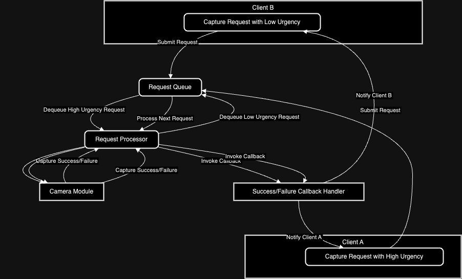

# Low-Level Design (LLD) Document for Camera-System

## 1. Overview
This document details the class structure and method definitions for the camera-system. The system manages capture requests from clients, interacting with the camera-module to process and return captured images or error messages.

## 2. Classes and Interfaces

### 2.1 CameraSystem
- **Description**: Manages multiple clients, prioritizes requests, interacts with the camera-module, and handles callbacks.
- **Attributes**:
  - `requestQueue: RequestQueue`
  - `requestProcessor: RequestProcessor`
  - `callbackHandler: CallbackHandler`
- **Methods**:
  - `submitCaptureRequest(request: CaptureRequest)`
  - `registerSuccessCallback(callback: SuccessCallback)`
  - `registerFailureCallback(callback: FailureCallback)`
  - `processRequest()`

### 2.2 CaptureRequest
- **Description**: Represents a capture request from a client.
- **Attributes**:
  - `clientID: String`
  - `urgency: int`
  - `timestamp: DateTime`
  - `successCallback: SuccessCallback`
  - `failureCallback: FailureCallback`
- **Methods**: None (data class)

### 2.3 CameraModule (Abstract)
- **Description**: Abstracted component that performs the actual image capture.
- **Methods**:
  - `startCapture(successCallback: SuccessCallback, failureCallback: FailureCallback)`

### 2.4 SuccessCallback
- **Description**: Interface for handling successful image capture.
- **Methods**:
  - `onSuccess(image: Image)`

### 2.5 FailureCallback
- **Description**: Interface for handling capture failure.
- **Methods**:
  - `onFailure(error: ErrorMessage)`

### 2.6 RequestQueue
- **Description**: Priority queue for managing capture requests.
- **Attributes**:
  - `queue: PriorityQueue<CaptureRequest>`
- **Methods**:
  - `enqueue(request: CaptureRequest)`
  - `dequeue(): CaptureRequest`

### 2.7 RequestProcessor
- **Description**: Processes capture requests by interacting with the camera-module.
- **Methods**:
  - `run()`
  - `processRequest(request: CaptureRequest)`

### 2.8 CallbackHandler
- **Description**: Handles the invocation of success or failure callbacks.
- **Methods**:
  - `handleSuccess(request: CaptureRequest, image: Image)`
  - `handleFailure(request: CaptureRequest, error: ErrorMessage)`

## 3. Interaction Flow (Use-Case Diagram)

### Scenario: Concurrent Requests with Different Urgency Levels

1. **Client Interaction**: 
   - Clients invoke `submitCaptureRequest()` on the `CameraSystem` with their respective callbacks and urgency levels.

2. **Request Queue Management**: 
   - Requests are prioritized and stored in the `RequestQueue`.

3. **Processing**: 
   - The `RequestProcessor` dequeues and processes the highest priority request.

4. **Callback Handling**: 
   - Depending on the camera-module’s response, the appropriate callback is invoked by the `CallbackHandler`.

### Explanation:

- **Client A**: Submits a high-urgency capture request.
- **Client B**: Submits a low-urgency capture request.
- **Request Queue (RQ)**: Holds both requests and prioritizes them based on urgency.
- **Request Processor (RP)**: Processes the high-urgency request from Client A first by sending it to the Camera Module (CM).
- **Camera Module (CM)**: Captures the image asynchronously and sends the result back to the Request Processor.
- **Success/Failure Callback Handler (SC)**: Invokes the appropriate callback based on the capture result and notifies Client A.
- **Request Processor (RP)**: Then processes the next request (low urgency) from Client B following the same steps.

This diagram illustrates the decision-making process of prioritizing and processing requests based on urgency and handling callbacks accordingly.

## 4. Extendibility

- **New Capture Strategies**: Additional capture strategies or prioritization mechanisms can be easily integrated by extending the `RequestQueue` or adding new classes.
- **Error Handling**: Enhanced error handling can be incorporated by extending the `CallbackHandler`.

## 5. Conclusion

The LLD provides a detailed blueprint for implementing the camera-system, ensuring that it meets the design requirements. The modular structure supports easy extension and maintenance.
